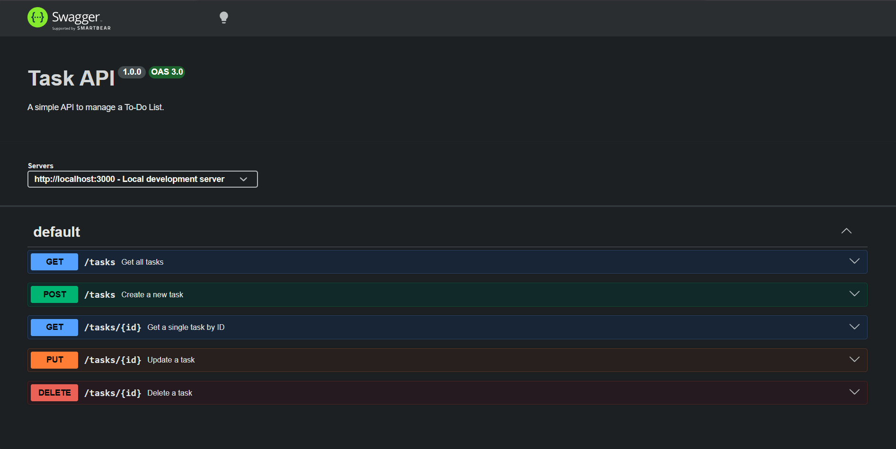

# To-Do API

This is a simple RESTful CRUD API built with Express.js for managing a To-Do list. All tasks are stored in memory.

## How to Install & Run

Ensure you have Node.js and `pnpm` installed.

1. Install dependencies:
   ```bash
   pnpm install
   ```
2. Start the development server:
   ```bash
   pnpm dev
   ```
The API will be available at `http://localhost:3000`.

## Endpoints

| CRUD operation | HTTP method | Endpoint | Meaning |
|---|---|---|---|
| Read (All) | `GET` | `/tasks` | List all tasks |
| Read (Single) | `GET` | `/tasks/:id` | Get task by ID |
| Create | `POST` | `/tasks` | Add a new task |
| Update | `PUT` | `/tasks/:id` | Change task by ID |
| Delete | `DELETE` | `/tasks/:id` | Remove task by ID |
| Documentation | `GET` | `/docs` | Interactive Swagger UI |
| Health Check | `GET` | `/health` | Check if server is running |

## Example Request

```http
HTTP/1.1 201 Created
X-Powered-By: Express
Content-Type: application/json; charset=utf-8
Content-Length: 46
Date: Sat, 18 Jul 2026 13:00:00 GMT
Connection: keep-alive

{"id":4,"title":"Buy Yakult","done":false}
```

## Swagger UI

Interactive API documentation is available at `/docs`.


